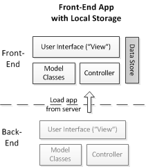

# JavaScript Front-End Web App Tutorial
[Source](https://www.codeproject.com/Articles/753724/JavaScript-Front-End-Web-App-Tutorial-Part)

## Overview
### Features
* No third-party frameworks, e.g. jQuery/Angular/React, which create black-box deps and overheads.
* Includes one object type: Book
* Includes the standard CRUD data management operations: Create, Read, Update, Delete
* Enhanced by styling UI with CSS
* Input via HTML forms


### Objective
Manage information about books

### Architecture

* Executed on user's client, not on remote web server.
* Client side rendering
* Persistent storage in 
* Persistent storage in client device, managed using `Local Storage`. Other options include IndexDB.
* 
## Step 1: HTML, CSS and JS

### HTML Overview

HTML = HTML5 = XHTML5

XHTML5 is used, but may be represented as HTML or HTML5.

XHTML5 is used as it has the clear syntax of XML docs over the liberal and confusing HTML4 syntax (that is also allowed by HTML5).

### Tags
#### Preamble
* `<!DOCTYPE html>`: Doctype preamble. Tells browser what rendering mode to use. HTML is the modern standard but there are legacy standards used from before it was standardised.
* `<html>`: Root of html doc. Provides container for all html elements.

#### Elements
* `<head>`: metadata element. Defines doc title, character set, styles, scripts etc. Placed after root and before body.
* `<a>`: anchor element. Creates hyperlink to URI stored in `href`
* `<ul>`: unordered list. Contains items.
* 

#### Deprecated
* `<menu>`: menu tag. Creates list of interactive menu items. Replaced by `<ul>`.


## JS Objects Overview
**JS objects**
* need not instantiate a class.
* have property slots (object variables)
* may have method slots
* may have key-value slots

A **record** is a set of property slots, e.g.
```
var myRecord = { firstName:"Tom", lastName:"Smith", age:26}
``` 

A **map** is a set of key-value slots, where the key is a string, e.g.
```
var numeral2number = { "one":1, "two":2, "three":3}
```

An **untyped object** does not instantiate a class, e.g,
```
var person1 = {  
  lastName: "Smith",  
  firstName: "Tom",
  getInitials: function () {
    return this.firstName.charAt(0) + this.lastName.charAt(0); 
  }  
};
```

A **namespace** encapsulates variables to prevent unwanted interaction, and can be defined using an untyped object, e.g.
```
var myApp = { model:{}, view:{}, ctrl:{} };
```
A **typed object** instantiates a class, e.g.
```
var o = new C(...)
```
Types can be retrieved using the following expression" `o.constructor.name  // returns "C"`

A **class** is defined using a constructor function which accepts params, and assigning them to the class props, e.g.
```
function Person( first, last) {
  this.firstName = first; 
  this.lastName = last; 
}
```
Instance-level methods can be defined via function slots of the prototype object property of the constructor function, e.g.
```
Person.prototype.getInitials = function () {
  return this.firstName.charAt(0) + this.lastName.charAt(0); 
}
```
Class-level static methods can be defined via functions slots of the constructor function, e.g.
```
Person.checkName = function (n) {
  ... 
}
```


## Step 2: Responsive (HTML5) constraint validation
## Step 3: Enumerations
## Step 4: Unidirectional Associations
## Step 5: Bidirectional Associations
## Step 6: Subtype Inheritance in Class Hierarchy